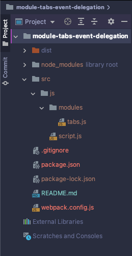

# module-tabs-event-delegation
Модуль содержит скрипт для создание табов с применением принципов ___Делигирования событий___.

<br />

## Дерево файлов и каталогов
Необходимо сформировать файловое дерево в соответствие с настройками ___Webpack___ и ___GulpJS___. Данные настройки находятся в одноименных файлах: ___webpack.config.js___ и ___gulpfile.js___, если таковые имеются в репозитории.

<br />



> Важно! В подключаемых файлах нужно прописать правильные пути. Большинство ошибок допускаются в путях.

<br />

## Подключение модуля
В данном репозитории точкой вхождения ___Webpack___ является _./src/js/script.js_.
<br /> Импортируем в него модуль со скриптом слайдера:
```javascript
// Точка вхождения Webpack: "./src/js/script.js'
"use strict";

import tabs from './modules/tabs';
window.addEventListener('DOMContentLoaded', () => {
    tabs('.tabheader__item', '.tabcontent', '.tabheader__items', 'tabheader__item_active');
});
```
<br />

## Деструктуризация объекта с аргументами
Функция tabs() принимает объект следующих аргументов {}:

| Аргумент | Селектор | Значение | 
| :---- | :---- | :--- |
| tabSelector | .tabheader__item | Кнопки для смены табов |
| tabsContentSelector | .tabcontent | Часть конкретного таба с описанием |
| tabsParentSelector | .tabheader__items | Пэрент, делегирующий события на чилдрен |
| activeClass | .tabheader__item_active | Класс активности |

